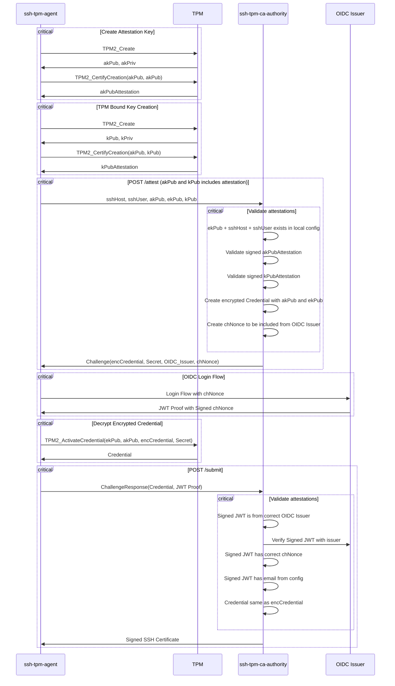

The past year I have been hacking around on tools utilizing TPMs, and one of the
features I have been interested to learn more about is the device attestation
features.

After being a bit inspired by some ideas from people at work, the hackerspace
and toots on mastodon, I figure out a SSH certificate authority would be a cool
small project to hack on. Last year I wrote an SSH agent with TPM bound keys so
this would nicely fit into the existing tooling.

When people acquire credentials by proving who they are it is usually bound by
some identity claim. In an enterprise setting this identity claim is proven by
them logging through an identity provider (IdP) which can be provided by things
like keycloak, Microsoft, Google or Github. This is largely based on Open ID
Connect (OIDC) which can provide signed JWT tokens that have certain claims
about the identity of the user.

The login itself (hopefully) has Two-Factor Authentication (2FA) which means you
have something you know, and something you possess to get through the login. The
possession part is usually a FIDO token like a Yubikey. The knowing part is the
password.

All of this is nice and dandy, and certainly good enough for most scenarios. But
considering we have a Trusted Platform Module (TPM) available in most machines
today we can probably do better. TPMs allows you to implement remote device
attestation to prove you are sitting on a specific device, they also allow us to
shield keys inside the TPMs which can't be extracted from the device nor
decrypted[^tpm-key].

It would be cool if we could issue SSH certificates by providing an identity
claim, and perform some device attestation to ensure we are authenticating from
a specific machine. In an enterprise setting this is nice as you most likely
want people to only access services through your work managed machines and not
the 10 year old Windows XP machine.

In a personal setting this is handy as you could just go to your self-hosted
certificate authority, declare all the machines you possess and avoid having to
figure out how to manage all your SSH keys.

```bash
λ ~ » ls .ssh/keys | wc -l
18
```

And well, I can't be the only one!

`ssh-tpm-ca-authority` is my, very POC quality, take on an SSH certificate
authority that can sign short lived SSH certificates by logging into an IdP and
proving you are in possession of a given device. The IdP part is currently
implemented through the public [DEX](https://github.com/dexidp/dex) instance hosted by sigstore.

https://github.com/foxboron/ssh-tpm-ca-authority

This blog post is going to be split into two parts. First part will explain
`ssh-tpm-ca-authority` and the usage of it, and the second part is going to try
and explain the implementation of the device and identity attestation. 

Part of the project is going to rely on `ssh-tpm-agent`, which is an ssh agent
that enables you to create and maintain TPM backed keys for ssh. If you are
unfamiliar with the project please read the [blog post](https://linderud.dev/blog/store-ssh-keys-inside-the-tpm-ssh-tpm-agent/) I made about it last year, or visit the [github repository](https://github.com/Foxboron/ssh-tpm-agent).

## Threat Model

Before we start it should be noted what the current threat model is;

* We trust the enrollment of the EK into the CA server.
* We trust the CA server is not acting maliciously.
* We trust that the sigstore DEX instance is acting in good faith.
* We trust TPMs are reasonably secure devices.

Some of this is to just make it easier to implement the POC. However things like
the EK enrollment being trusted is important as it's terribly hard to do this
post factum. 

## ssh-tpm-ca-authority

`ssh-tpm-ca-authority` implements the certificate authority service through an
REST API. It is configured by a YAML file that denotes the host and the
users. Each user has a username, an `oidc_connector`, which is the expected IdP
they will be using, and the Endorsement Key (EK) which is unique per machine.

First we need to create a new ssh key that will function as the signer for the
CA. Currently only TPM keys are supported and they can be generated through
`ssh-tpm-keygen` from `ssh-tpm-agent`.

```bash
λ ssh-tpm-ca-authority » ssh-tpm-keygen -f ./id_ecdsa
Generating a sealed public/private ecdsa key pair.
Enter pin (empty for no pin): (empty pin here)
Confirm pin: (and empty again)
Your identification has been saved in ./id_ecdsa.tpm
Your public key has been saved in ./id_ecdsa.pub
The key fingerprint is:
SHA256:0IdA5wCzWACZBYscEwgnVkOBr5++G19nEMuqFGMQPVs
The key's randomart image is the color of television, tuned to a dead channel.
```

An example configuration file:

```yaml
---
hosts:
  - host: my.ssh.server.com
    ca_file: ./id_ecdsa.tpm
    users:
      - user: fox
        oidc_connector: https://github.com/login/oauth
        email: morten@linderud.pw
        ek: 000ba1d6910d32dbafb47e1365e8a84606aaefc9bb2404f4f99082f6284a9b33415c
```

`ca_file` is the keyfile we created previously, and the one that will act as the
key signing our CA.

Each user needs to be configured with a username, that the client will request
with, an `oidc_connector` which is how we will authenticate the identity, and
the EK, which we need to fetch from each client we are enrolling. The EK is the
value we'll be using to attest and ensure the clients connecting is possessing
the correct device.

To retrieve the given EK from a client one can use the `./cmd/getek` from the
source repository.

```bash
λ ssh-tpm-ca-authority master » go run ./cmd/getek
000ba1d6910d32dbafb47e1365e8a84606aaefc9bb2404f4f99082f6284a9b33415c
```

Now `my.ssh.server.com` needs to have `id_ecdsa.pub` available as
`TrustedUserCAKey` in `/etc/ssh/sshd_config`. This is how each ssh server will
recognize the issues certificate as valid.

Once we have a working configuration we will run the CA server and continue with
our client setup.

```bash
λ ssh-tpm-ca-authority master » go run ./cmd/ssh-tpm-ca-authority
2024/08/30 23:09:10 HTTP server listening on :8080
```

## ssh-tpm-agent

For the client setup we need a way to ask the CA server for a certificate when
connecting to the given server. We are only in control of the ssh agent in this
implementation. Using `match host exec` in your ssh config allows you to execute
arbitrary commands when you ssh to a given server[^ssh-match].

To ask `ssh-tpm-ca-authority` for a certificate we can add the following line to
our local ssh config.

```bash
Match host my.ssh.server.com exec "ssh-tpm-add --ca 'http://127.0.0.1:8080' --host '%h' --user '%r'"
```

This assumes you have a local instance of `ssh-tpm-agent` running, and being
used as the agent for the server. 

When connecting to `my.ssh.server.com` with `ssh`, it will fetch a certificate
remotely and make it available in the agent before we authenticate towards the
remote server. If the commands fail it will fallback to any other options you
have in your configuration. This is all there is to the client setup, and
everything should work.

Rest of the post is going to describe the technical details of the
implementation.


# Client Attestation

In an attempt at visualizing what happens between the TPM, `ssh-tpm-agent` and
`ssh-tpm-ca-authority` I made a sequence diagram.




Essentially there are two requests at play here, `/attest` and `/submit`. This
implements a "challenge-response" API where the client does not know what the
configuration of the service. It's just going to blindly ask for some access
with the information it has, and if the server validates this, it will return a
challenge to the client. The client needs to respond to this challenge to get a
SSH signed certificate back.

`/attest` is the initial call the client issues towards the server. The JSON
request contains the important details. The ssh host and ssh user we are
requesting this as. The public portion of the EK of the client. And then two
sets of attestations. One for the Attestation Key (AK) and one for the TPM Bound
key.

The client will make a TPM bound key and an Attestation Key with some
attestation details, and fetch the current endorsement key. It will hand this to
the server together with the SSH user and host.

Here represented as two Go structs.



type Attestation struct {
	Public            *tpm2.TPMTPublic
	Signer            *tpm2.TPMTPublic
	CreateData        []byte
	CreateAttestation []byte
	CreateSignature   []byte
}

type AttestationParameters struct {
	Host        string
	User        string
	EK          *tpm2.TPMTPublic
	AK          *Attestation
	TPMBoundKey *Attestation
}


The server make sure the ssh user, ssh host and the ek are all present for the
user+host+ek combination found in the configuration file. Once this passes we
check the attestation of the keys.

The Attestation Key attests the creation of it self, and the creation of the TPM
bound key. This seems a bit counter intuitive at first, but it's important to
realize that we don't trust anything yet. The create data is the output of the
TPM command `TPM2_CertifyCreation` which is a command that will sign and provide
an attestation that proves the objects where created on the TPM.

We validate all the details here. The signature is done by the AK. The object
has the properties of a non-exportable and secret key that can be loaded by the
TPM. But we don't trust anything yet. 

The way we establish trust is to do something called "Credential Protection"[^credproc]. The
Endorsement Key, which is unqiue pr device, can't sign anything. Instead it can
only do encryption and decryption operations. "Credential Wrapping" is a way to
encrypt a secret out-of-bound by utilizing the public portion of the Attestation
Key and the Endorsement key. Our assumption is that only the Endorsement Key
residing in the TPM of the client device is capable of decrypting this secret,
and we will be using this as a form of "proof-of-possession" of the device. The
secret is just a random secure string that we store for the completion of the
API.

As we also require a way to confirm the client is in possesion of the identity.
For this we make a nonce that will be part of the Open ID Connect login flow
which will then be embedded into the signed JWT from the service.


type EncryptedCredential struct {
	Credential []byte
	Secret     []byte
	OIDC       string
	Nonce      string
}


Once the client get `EncryptedCredential` it does the OIDC login flow with the
given issuer in the `OIDC` field, including the nonce from the server`.
`Credential` and `Secret` are passed to `TPM2_ActivateCredential` where the
Attestation Key and the Endorsement Key residing on the TPM is used to decrypt
the secret.

`/submit` is then called with the response signed JWT of the OIDC login flow and the
decrypted secret.


type ChallengeResponse struct {
	Secret []byte
	Jwt    string
}


The server will then ensure that the secret is the correct value we expect, and
the JWT is properly signed from the IdP of the portal. We also ensure that the
email present in the JWT is the email we are expecting from the configuration.

Once all of this has been done, we will create a SSH Certificate from the TPM
bound key we got earlier, and signed with the given CA key of the server.

## Demo

Below is a quick demo how it works. I'm ssh-ing to my NAS and running the CA
server locally with `ssh-tpm-agent`.



# POC Quality and issues

The IdP portion of this POC is a bit hastly done. To try and make this easier
for myself I have opted to use the public `sigstore` DEX instance. This is easy
from a POC perspective as it allows me to quickly get some form of identity
portal with OIDC up and running. However it doesn't provide the security
guarantees you would like to see.

DEX only gives claims on primary emails that belongs to the account, and we are
explicitly trusting `sigstore` instead of the identity providers themself.

The solution would be to rely on them directly, but as each provider implements
OIDC differently and provides different claims. Google doesn't include any
information if the account logged inn with 2FA/FIDO or just a password[^google].
Microsoft does this through the `acr` claim but it seems to be
context-dependant[^mfa-acr], and thus you need to implement this on a per provider
basis.

I am also not quite sure if there is a strong enough connection between the OIDC
identity claims with the nonce and the device attestation? I suspect instead of
creating a nonce we could just use the encrypted challenge as the nonce instead?
This would prevent someone from running of with the nonce, MITM a connection and
provide the identity claim out-of-bounds from the device that is dealing with
the TPM. But at this point I feel like I'm comming up with immaginary threat
scenarios.


Generally, I think this is a cool demo and it was a fun project to hack on.
Hopefully gives people some new insight into how we can incorporate device
attestation. I don't see a lot of people utilizing TPMs in Open Source projects,
and I think that is a shame as they do provide quite nice security properties
considering how ubiquitous they are.

All of the code can be found here: https://github.com/Foxboron/ssh-tpm-ca-authority

[^google]: https://stackoverflow.com/questions/45301632/google-oauth2-api-check-user-has-two-factor-authentication-not-gsuite
[^mfa-acr]: https://www.googlecloudcommunity.com/gc/Apigee/How-to-check-if-a-Google-user-have-MFA-enabled/m-p/607462/highlight/true#M75716
[^credproc]: Section 24 "Credential Protection": https://trustedcomputinggroup.org/wp-content/uploads/TPM-2.0-1.83-Part-1-Architecture.pdf
[^tpm-key]: Here is a SSH key I've added to my github. The pin is `1234`. https://gist.github.com/Foxboron/e15fcaa3c497c40c4c8e75130f551e2e
[^ssh-match]: https://man.archlinux.org/man/ssh_config.5#Match
